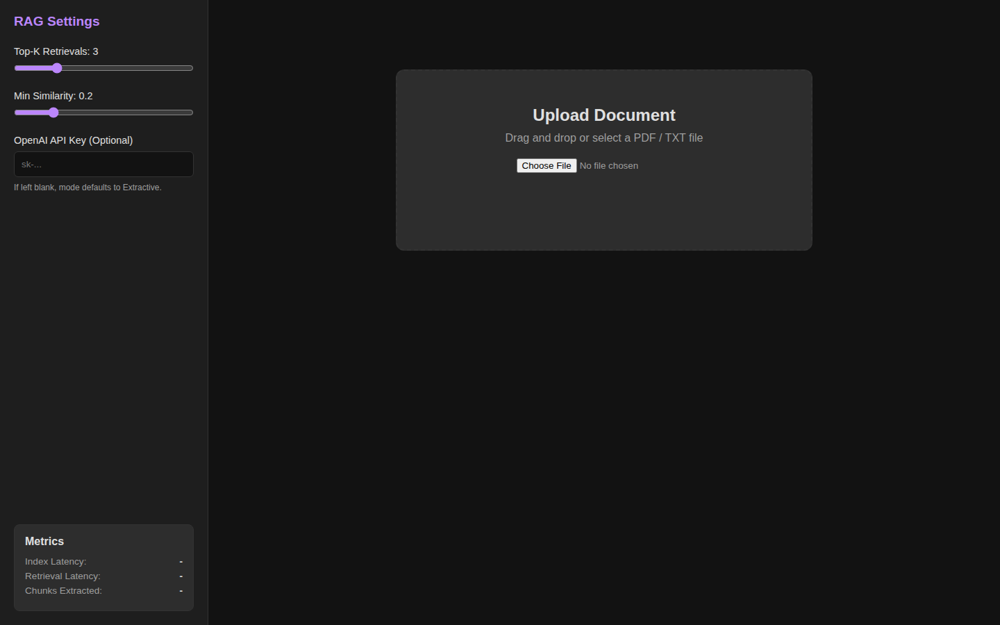
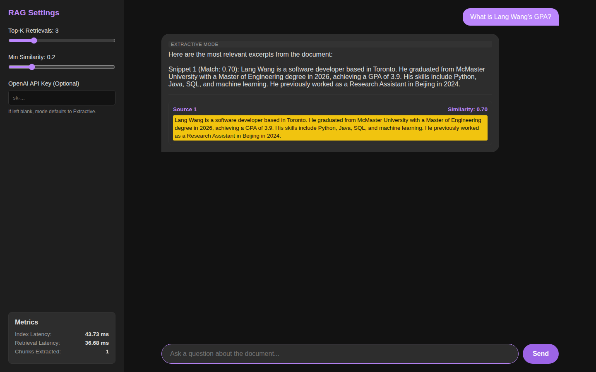

# rag-doc-qa-demo

A local, zero-infrastructure Retrieval-Augmented Generation (RAG) Document Q&A demo. Upload a PDF or Text file, ask questions, and receive answers grounded in the document text with highlighted source citations.

## HONESTY Statement

**IMPORTANT:** This is a self-directed learning project built strictly to explore and understand Retrieval-Augmented Generation (RAG) principles. It is **not** connected to, affiliated with, or built for any employment, client, or research work.

## How it Works

The application operates locally without needing external vector databases:
1. **Chunking**: Uploaded PDF/TXT files are parsed (via `pypdf`) and split into overlapping text chunks to preserve context.
2. **Embeddings**: Chunks are processed locally using `sentence-transformers` (`all-MiniLM-L6-v2`) to convert text into dense vector representations.
3. **Retrieval**: `faiss-cpu` is used to index vectors and perform blazing-fast cosine-similarity search against user queries.
4. **Answer Generation**:
   - **Extractive Mode (Default)**: Returns the raw top-k retrieved snippets highlighting the most relevant context directly. Zero API keys required.
   - **Generative Mode (Optional)**: If you provide an OpenAI-compatible API key via the UI settings, the app constructs a prompt containing the retrieved context and calls a chat-completions API to synthesize a cohesive answer while still citing the source snippets.

## How to Run

1. **Install Prerequisites**: Ensure you have Python 3.9+ installed.
2. **Install Dependencies**:
   ```bash
   pip install -r backend/requirements.txt
   ```
3. **Start the Backend Server**:
   ```bash
   uvicorn app:app --app-dir backend --host 0.0.0.0 --port 8000
   ```
   Note: On the first run, the `sentence-transformers` model will download (approx 90MB). Once loaded, you will see `Model loaded successfully.` in the terminal.
4. **Open the Frontend**: Simply open the `frontend/index.html` file in your preferred web browser. No local web server is required for the frontend, but you can serve it with `python -m http.server` if you prefer.

## Screenshots

| Upload | Chat with Citations |
|---|---|
|  |  |

## Example Demo Script

1. Run the app and open the UI in your browser.
2. Upload a sample Resume PDF (e.g., your own resume). Wait a few seconds for the indexing progress to complete.
3. In the Chat UI, ask: "What are his skills?" or "What college did they attend?"
4. View the Extractive answer immediately showing the specific source chunk in yellow.
5. In the settings panel (sidebar), paste an OpenAI API key.
6. Ask another question: "Summarize his work experience."
7. View the Generative response synthesized by the LLM, followed by the specific cited sources underneath.
